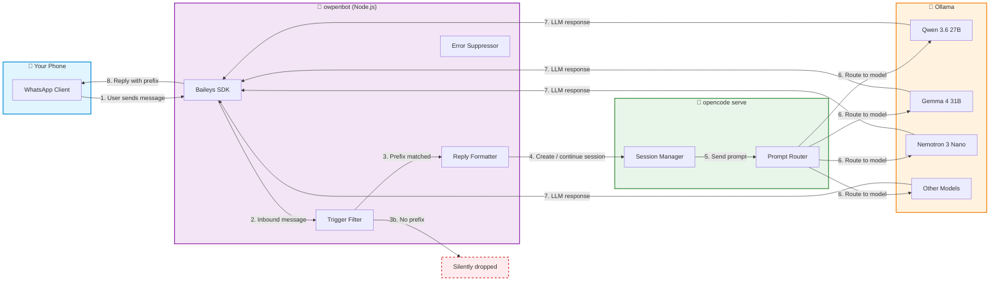

# WhatsApp → OpenCode Bridge

A messaging bridge that routes WhatsApp messages to a local LLM, powered by [owpenbot](https://github.com/tonyalar/owpenbot), [opencode](https://github.com/opencode-ai/opencode), and [Ollama](https://ollama.com/).

## Architecture



## How It Works

The bridge operates as a four-stage pipeline. Each stage maps to a numbered step in the diagram above.

### Stage 1: WhatsApp Inbound (Steps 1-2)

You send a WhatsApp message to your own number. The **Baileys SDK** (`@whiskeysockets/baileys`) running inside owpenbot intercepts the message via a WhatsApp Web emulation session. Baileys maintains a persistent WebSocket connection to WhatsApp's servers, handling reconnection and session persistence automatically.

### Stage 2: Trigger Filter (Steps 3-3b)

Before the message reaches the LLM, it passes through a **trigger prefix filter**. Only messages that start with the configured prefix (default: `~`) are processed. If a message does not match, it is silently dropped — nothing is logged, nothing is sent back. This gives you a hard on/off switch per message.

The prefix is stripped before the message is forwarded, so the LLM never sees it.

### Stage 3: Session & Prompt Routing (Steps 4-6)

Matching messages are forwarded to **opencode serve**, a headless API server. opencode manages conversation sessions — each chat thread gets a persistent session ID that preserves context across messages. The session manager routes the prompt through **Ollama**'s OpenAI-compatible API to whichever model is configured.

### Stage 4: Reply Formatting & Error Suppression (Steps 7-8)

The LLM response flows back through the pipeline. Before being sent to WhatsApp:

- A **reply prefix** (`[🤖 AI]: `) is prepended, making it visually clear the message came from AI
- If the LLM call fails, the error is logged to disk but **not** sent to WhatsApp, preventing accidental error messages in your conversations

## Prerequisites

- **Ollama** running and accessible (can be local or remote)
- **opencode** CLI installed
- **Node.js** (>= 18) and **pnpm**
- A WhatsApp account (self-chat uses your own number)

## Quick Start

### 1. Clone and Build owpenbot

```bash
git clone https://github.com/tonyalar/owpenbot.git /tmp/owpenbot
cd /tmp/owpenbot
pnpm install
pnpm run build
```

### 2. Configure

Copy `.env.example` to `/tmp/owpenbot/.env` and edit:

```bash
cp .env.example /tmp/owpenbot/.env
```

**Critical:** `WHATSAPP_SELF_CHAT` must be `true` for self-messages to work. Environment variables override the JSON config file.

### 3. Pair WhatsApp

```bash
cd /tmp/owpenbot
node dist/cli.js whatsapp login
```

Scan the QR code with your phone. Credentials are persisted across restarts.

### 4. Start Services

```bash
# Method A: systemd (recommended)
systemctl --user start opencode-serve owpenbot

# Method B: manual
opencode serve --port 4096
node /tmp/owpenbot/dist/cli.js start
```

### 5. Test

Send yourself a WhatsApp message prefixed with `~`, e.g.:

```
~ hello
```

You should receive back:

```
[🤖 AI]: Hello! How can I help?
```

## Configuration

### Trigger Prefix (`WHATSAPP_TRIGGER_PREFIX`)

Messages must start with this string to be processed. Default: `~`

| Your Message | Result |
|---|---|
| `~ what is 2+2` | Processed as `what is 2+2` |
| `what is 2+2` | Silently ignored |
| `~` | Ignored (empty after prefix) |

### Reply Prefix (`WHATSAPP_REPLY_PREFIX`)

String prepended to all LLM replies. Default: `[🤖 AI]: `

### Error Suppression (`WHATSAPP_SUPPRESS_ERRORS`)

When `true`, LLM failures are logged but never sent to WhatsApp. Default: `true`.

### Self-Chat Mode (`WHATSAPP_SELF_CHAT`)

Must be `true` to allow self-messages. **Note:** `.env` values always override `owpenbot.json`.

## Persistence

Two systemd user services are provided in `systemd/`:

- `opencode-serve.service` — opencode headless server on port 4096
- `owpenbot.service` — owpenbot bridge, depends on opencode-serve

Install them to `~/.config/systemd/user/`, then reload:

```bash
cp systemd/*.service ~/.config/systemd/user/
systemctl --user daemon-reload
```

The services are **disabled by default** — they start only when you explicitly start them:

```bash
systemctl --user start opencode-serve owpenbot   # start
systemctl --user stop opencode-serve owpenbot    # stop
```

## Troubleshooting

### Self-messages silently dropped

Check that `WHATSAPP_SELF_CHAT=true` in `.env`. Environment variables override the JSON config.

### "Access denied" messages on reconnect

WhatsApp replays offline messages on reconnect. Messages from numbers not on your allowlist will be rejected. This is expected.

### owpenbot slow to stop

Baileys WebSocket teardown can take time. If `systemctl --user stop` hangs, use `systemctl --user kill --signal=9 owpenbot`.

## Security

The opencode serve API listens on `127.0.0.1` only. If you expose it beyond localhost (e.g., via tunnel, reverse proxy, or `0.0.0.0`), set `OPENCODE_SERVER_PASSWORD` in `.env`. The API can execute arbitrary tools and exposes full session history.

## Files

| File | Purpose |
|---|---|
| `.env.example` | owpenbot environment template |
| `systemd/*.service` | systemd unit files for both services |
| `build-log.md` | Detailed development diary of this build |

## Credits

- [owpenbot](https://github.com/tonyalar/owpenbot) — messaging bridge
- [opencode](https://github.com/opencode-ai/opencode) — headless LLM server
- [Baileys](https://github.com/WhiskeySockets/Baileys) — WhatsApp Web SDK
- [Ollama](https://ollama.com/) — local model inference
